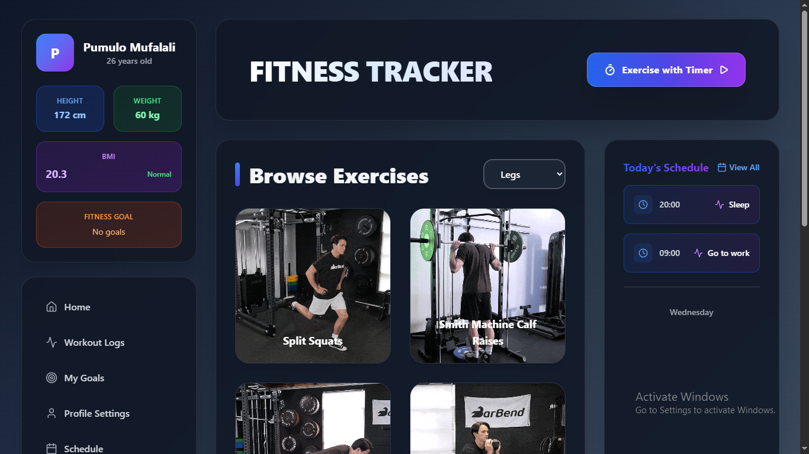
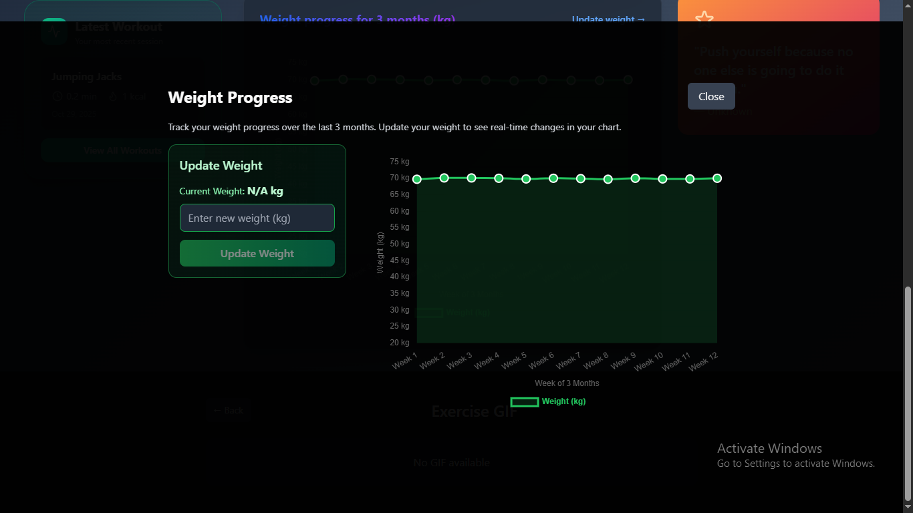
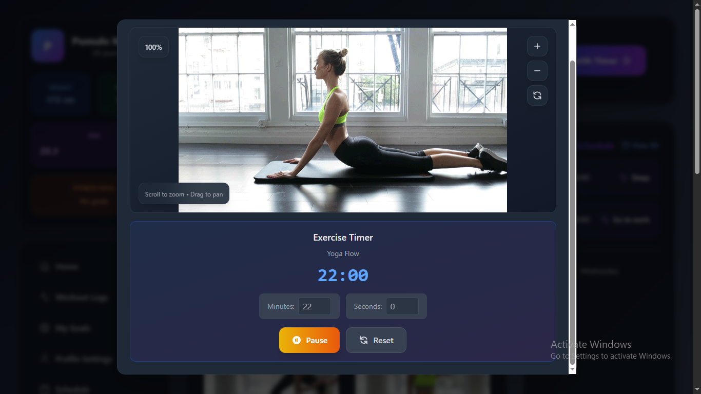

# MyFitness - Full-Stack Fitness Tracker Application

A comprehensive fitness tracking application built with the T3 Stack (React, TypeScript, tRPC) and Firebase. Track your workouts, monitor progress, set goals, manage schedules, and achieve your fitness milestones.


## Features

### Dashboard & Tracking
- **Weight Progress Tracking**: Visualize your weight journey with interactive charts
- **Workout Logging**: Log workouts with duration, exercises, and notes
- **Exercise Browser**: Browse exercises by category (cardio, strength, stretching, full body)
- **Today's Schedule**: View and manage your daily workout schedule
- **Recent Workouts**: Quick access to your workout history
- **Achievements System**: Unlock achievements as you reach milestones

### Goals Management
- Create and track fitness goals (weight loss, gain, etc.)
- Set target dates and monitor progress
- Visual progress indicators
- Goal insights and recommendations

### Schedule Management
- Weekly workout schedule planning
- Day-by-day activity scheduling
- Exercise time and activity tracking
- Schedule persistence and preferences

### User Profile & Settings
- User profile management
- Unit conversion (metric/imperial)
- Theme preferences (light/dark/system)
- Language settings
- Privacy and notification preferences
- Account details management

### Security & Authentication
- Firebase Authentication (email/password)
- Comprehensive Firestore security rules
- User-specific data access
- Protected routes and API endpoints

### User Experience
- Modern, responsive UI with Tailwind CSS
- Dark mode support
- Smooth animations with Framer Motion
- Mobile-friendly design
- Error boundaries and graceful error handling

## Screenshots

### Dashboard
The main dashboard provides an overview of your fitness journey with key statistics, recent workouts, and progress tracking.



### Weight Progress
Track your weight over time with interactive charts and detailed statistics.



### Workout Logs
View and manage your complete workout history with detailed logs of all your exercise sessions.


### Workout Session
Log your workouts with exercise selection, duration tracking, and session notes.



## Tech Stack

### Frontend
- **React 18.3** - UI library
- **TypeScript 5.6** - Type safety
- **Vite 5.4** - Build tool and dev server
- **Tailwind CSS 3.4** - Styling
- **React Router 7** - Routing
- **Framer Motion** - Animations
- **Chart.js** - Data visualization
- **React Query (TanStack Query)** - Server state management
- **Lucide React** - Icons

### Backend
- **Firebase**
  - Authentication
  - Firestore (NoSQL database)
  - Cloud Functions (tRPC server)
  - Hosting
- **tRPC** - End-to-end typesafe APIs
- **Zod** - Schema validation

### Development Tools
- **Turborepo** - Monorepo build system
- **PNPM** - Package manager
- **Vitest** - Testing framework
- **ESLint** - Linting
- **Prettier** - Code formatting

## Project Structure

```
MyFitness/
├── apps/
│   └── web/                    # Frontend React application
│       ├── src/
│       │   ├── components/     # React components
│       │   ├── pages/          # Page components
│       │   ├── lib/            # Firebase services & utilities
│       │   ├── providers/      # Context providers
│       │   └── utils/          # Utility functions
│       └── dist/               # Build output
│
├── packages/
│   ├── shared/                 # Shared types and schemas
│   │   └── src/
│   │       └── schemas.ts      # Zod schemas
│   │
│   └── functions/              # Firebase Cloud Functions (tRPC)
│       └── src/
│           ├── routers/        # tRPC routers
│           ├── context.ts      # Request context
│           └── index.ts        # Function entry point
│
├── firebase.json               # Firebase configuration
├── firestore.rules            # Security rules
├── turbo.json                 # Turborepo configuration
└── package.json               # Root workspace configuration
```

## Getting Started

### Prerequisites

- **Node.js** 18+ and **PNPM** 9.0+
- **Firebase CLI** installed globally
- Firebase project set up in [Firebase Console](https://console.firebase.google.com)

### Installation

1. **Clone the repository**
   ```bash
   git clone <repository-url>
   cd MyFitness
   ```

2. **Install dependencies**
   ```bash
   pnpm install
   ```

3. **Set up Firebase**
   ```bash
   # Login to Firebase
   firebase login
   
   # Set your Firebase project
   firebase use <your-project-id>
   ```

4. **Configure environment variables**
   
   This project supports multiple environments (dev, staging, prod). See [Environment Setup Guide](./docs/ENVIRONMENT_SETUP.md) for detailed instructions.
   
   Quick setup for development:
   ```bash
   # Copy the example file
   cp apps/web/.env.example apps/web/.env
   
   # Or use the environment switcher
   pnpm env:dev
   ```
   
   Then edit `apps/web/.env` with your Firebase credentials:
   ```env
   VITE_FIREBASE_API_KEY=your-api-key
   VITE_FIREBASE_AUTH_DOMAIN=your-project.firebaseapp.com
   VITE_FIREBASE_PROJECT_ID=your-project-id
   VITE_FIREBASE_STORAGE_BUCKET=your-project.appspot.com
   VITE_FIREBASE_MESSAGING_SENDER_ID=your-sender-id
   VITE_FIREBASE_APP_ID=your-app-id
   VITE_TRPC_ENDPOINT=https://us-central1-your-project.cloudfunctions.net/trpc
   VITE_ENV=dev
   ```

5. **Build shared package**
   ```bash
   pnpm build --filter @myfitness/shared
   ```

## 💻 Development

### Run Development Server

```bash
# Start all apps in development mode
pnpm dev

# Start only the web app
pnpm --filter @myfitness/web dev
```

The web app will be available at `http://localhost:5173`

### Available Scripts

```bash
# Development
pnpm dev                    # Start all apps in dev mode

# Building
pnpm build                  # Build all packages
pnpm build:web              # Build only web app

# Type Checking
pnpm typecheck              # Type check all packages

# Linting
pnpm lint                   # Lint all packages

# Testing
pnpm test                   # Run all tests
pnpm --filter @myfitness/web test        # Run web app tests
pnpm --filter @myfitness/web test:coverage  # Run with coverage

# Environment Management
pnpm env:dev                # Switch to development environment
pnpm env:staging            # Switch to staging environment
pnpm env:prod               # Switch to production environment

# Database Seeding
pnpm seed:exercises         # Seed exercises to default environment
pnpm seed:dev               # Seed all data to development
pnpm seed:staging           # Seed all data to staging
pnpm seed:prod              # Seed all data to production

# Formatting
pnpm format                 # Format code with Prettier
```

## Deployment

### Multi-Environment Deployment

This project supports deploying to different environments (dev, staging, prod):

```bash
# Deploy to development
pnpm deploy:dev

# Deploy to staging
pnpm deploy:staging

# Deploy to production
pnpm deploy:prod
```

See [Environment Setup Guide](./docs/ENVIRONMENT_SETUP.md) for detailed instructions.

### Deploy Web App (Hosting + Firestore Rules)

For backward compatibility, this works on the **free Spark plan**:

```bash
pnpm deploy:all
```

Or deploy individually:

```bash
# Deploy hosting only
pnpm deploy:hosting

# Deploy Firestore rules only
pnpm deploy:rules
```

### Deploy Functions (Requires Blaze Plan)

If you have the Blaze plan, you can deploy tRPC functions:

```bash
pnpm deploy:functions
```

**Note**: Cloud Functions require the Firebase Blaze (pay-as-you-go) plan. The app works without functions, but some tRPC features will be unavailable.

### Deployment Scripts

```bash
pnpm deploy                 # Deploy hosting (builds first)
pnpm deploy:all              # Deploy hosting + Firestore rules
pnpm deploy:hosting          # Deploy hosting only
pnpm deploy:rules            # Deploy Firestore rules only
pnpm deploy:functions        # Build and deploy functions
pnpm deploy:debug            # Deploy with debug output
```

## Testing

The project includes comprehensive testing infrastructure:

- **Vitest** for unit and component testing
- **React Testing Library** for component tests
- **Playwright** for end-to-end testing
- **Storybook** for visual regression testing

```bash
# Unit & Component Tests
pnpm test                              # Run all tests
pnpm --filter @myfitness/web test      # Run web app tests
pnpm --filter @myfitness/web test:ui   # Run with UI
pnpm --filter @myfitness/web test:coverage  # Run with coverage

# End-to-End Tests
pnpm test:e2e                          # Run E2E tests
pnpm --filter @myfitness/web test:e2e:ui  # Run E2E with UI

# Storybook (Visual Regression)
pnpm storybook                         # Start Storybook
pnpm --filter @myfitness/web storybook # Start Storybook for web app
```

See [Testing Guide](./docs/TESTING.md) for detailed testing documentation.

## Packages

### `@myfitness/web`
The main React frontend application.

### `@myfitness/shared`
Shared TypeScript types and Zod schemas used across the monorepo.

**Schemas Include:**
- `UserSchema` - User profile data
- `GoalSchema` - Fitness goals
- `ExerciseSchema` - Exercise definitions
- `ScheduleSchema` - Workout schedules
- `LogEntryInputSchema` - Workout log entries

### `@myfitness/functions`
Firebase Cloud Functions implementing the tRPC API server.

**Routers:**
- `user` - User profile management (getProfile, updateProfile, createProfile)
- `goals` - Goals CRUD operations

## Security

### Firestore Security Rules
The project includes comprehensive security rules that enforce:
- User authentication requirements
- User-specific data access (users can only access their own data)
- Input validation for all collections
- Protection for: users, goals, weight, workouts, schedules, preferences, activity, achievements

### Authentication
- Firebase Authentication handles user sign-up and login
- All API routes require authentication
- User IDs are validated on all data operations

### Security Features
- **Dependabot:** Automated dependency scanning and updates (`.github/dependabot.yml`)
- **T3 Env:** Type-safe environment variable validation (`apps/web/src/env.ts`)
- **2FA Required:** All repository collaborators must enable two-factor authentication
- **Security Audit:** Weekly automated security audits via GitHub Actions
- **OWASP Top-10 Review:** Comprehensive security review documented in `docs/SECURITY.md`

See [Security Documentation](./docs/SECURITY.md) for detailed security practices and OWASP Top-10 review.

## Features Overview

### Pages
- **Dashboard** - Overview with stats, exercises, and schedule
- **Profile** - User profile management
- **Goals** - Create and track fitness goals
- **Exercises** - Browse exercise library
- **Workout Logs** - View workout history
- **Schedule** - Manage weekly workout schedule
- **Achievements** - View unlocked achievements
- **Settings** - App preferences and configuration

### Components
- Responsive navigation sidebar
- Interactive charts for weight progress
- Exercise browser with GIF modal viewer
- Workout logger with exercise tracking
- Goal creation and management forms
- Schedule creation and editing
- User profile cards and settings

## Configuration

### Firebase Configuration
Edit `firebase.json` to configure:
- Firestore rules location
- Hosting public directory
- Functions source directory

### Tailwind Configuration
Shared Tailwind config supports:
- Dark mode
- Custom color schemes
- Responsive breakpoints

### TypeScript Configuration
Strict TypeScript configuration across all packages with:
- Shared base config (`tsconfig.base.json`)
- Package-specific extends

## Contributing

1. Fork the repository
2. Create your feature branch (`git checkout -b feature/amazing-feature`)
3. Commit your changes (`git commit -m 'Add some amazing feature'`)
4. Push to the branch (`git push origin feature/amazing-feature`)
5. Open a Pull Request

### Code Style
- Follow the existing code style
- Run `pnpm format` before committing
- Ensure `pnpm lint` passes
- Write tests for new features

## License

This project is licensed under the MIT License.

## Acknowledgments

- [T3 Stack](https://create.t3.gg/) for the architecture inspiration
- [Firebase](https://firebase.google.com/) for backend services
- [tRPC](https://trpc.io/) for end-to-end type safety
- [Tailwind CSS](https://tailwindcss.com/) for styling
- [Chart.js](https://www.chartjs.org/) for data visualization

## Support

For issues and questions:
- Check existing issues in the repository
- Create a new issue with detailed information
- Review the documentation in `docs/` directory


